# **项目与项目**

##  第一章 项目与项目管理概述

### 何谓IT？

信息技术(Information Technology,简称IT)，是主要用于管理和处理信息所采用的各种技术总称。它主要应用计算机科学和通信技术来设计、开发、安装和实施信息系统及应用软件

 ### 何谓项目？什么组织需要做项目？

**项目**是为创造独特的产品、服务或成果而进行的“临时性工作”，具备以下特征：

   1. 独特性：历史上不存在完全相同的项目--创新性

   2. 临时性：有明确的起止时间

   3. 渐进明细：通过计划和控制实现

      

      **什么不是项目**：

         1. 生产                   重复性(缺乏创新)

         2. 运营                   无固定的结束时间

         3. 行政                   经验为主，已知较多(非渐进明细)

            

            

         

      **项目的约束**：

      § **范围**：项目的每一部分都有哪些工作？客户或发起人想要通过项目获得什么？

      § **时间**：完成这个项目需要多长时间？项目的进度安排是怎样的？团队如何跟踪实际进度？谁有权批准进度的变更？

      § **成本**：完成这个项目需要花费多少成本？这个项目的预算是多少？如何跟踪控制成本？

      

      

### 何谓管理、项目管理？什么项目需要管理？

​      **管理：**管事(知识、工具、方法) + 理人(思想、价值观、沟通)

​      **项目管理：**将知识、技能、工具与技术应用于项目活动，以满足项目的要求。

**干系人**：指参与项目或者受项目活动影响的人，包括项目发起人、项目团队、支持人员、客户、使用者、供应商、甚至是项目的反对者。

**项目管理的典型管理过程(使用于所有的项目)**：

### 何谓IT项目管理？什么人需要学习IT项目管理？

**如何定义IT项目的成功：**

1. 项目达到了范围、时间和成本目标
2. 项目使客户/项目发起人感到满意
3. 项目的结果达到了主要目标，比如赚取或节省了一定数目的钱，带来了好的投资收益。

**项目经理**：时常扮演领导者和管理者的双重身份，领导者引导团队做正确的事，管理者引导团队正确地做事

**项目经理应该具备的素质**：

# 第二章 项目来源、论证、立项与启动

## 项目来源、立项与启动

### 项目来源

1. 为外部甲方客户做项目
2. 研发新产品(服务互联网大众)

### 项目论证、立项

1. 承接外部IT项目的论证与立项

   

   #### 什么样的解决方案才是用户真正需要的：

   ​    解决客户“开源与节流”的问题

   ​        

   #### 产品构思(商业论证)做什么

   

   1. 用户需求(离苦得失)

      人们会把钱用在对抗痛苦和追求享乐上，产品应该解决了客户的某种痛点或者给客户带来了某种快乐。也或者将某种服务、技术做到更好，更用户带来更好的体验。

   2. 产品愿景(定位)

      

   3. 商业机会

      针对“问题”，提出改进的方案。并构建相应的商业模式(如何赚钱)

   4. 用户分析

      分析产品所服务的主要人群的特点，重点是用户的“痛处”或“愿望”，同时考虑其经济状况、消费观念、行为特征等多种因素，绘制清晰的用户画像。

   5. 技术可行性分析

      分析产品要采用的技术、平台、软硬件网络支持等，分析是否存在技术上的难点等

   6. 预估资源需求

   7. 风险分析

      风险是一种不确定事件或状况如果发生将会对至少一个项目目标(如范围、时间、成本或质量)产生正面或负面的影响。

   8. 收益分析

      **净现值分析**
   
      ​        **净现值**【**NPV**】：净现值指未来资金(现金)流入(收入)现值与未来资金(现金)流出(支出)现值的差额。（考虑了资本的时间价值，即:
      今天的1元钱 > 明天的1元）
   
      ​        **折现率**：将未来有限期预期收益折算成现值的比率
   
      ​        仅从财务角度看，NPV越高的方案越好
   
      ​        
   
      
   
      **投资回报率**【**ROI**】：
   
      ​       项目收益减去成本后，再除以成本的结果
   
      ​      –ROI= (折现收益总额 – 折现成本总额)/折现成本总额
   
      ​      ROI越高越好
   
      **投资回收期分析**【**PP**】：
   
      ​        又称”投资回收年限“。投资项目**投产后获得的收益总额**达到该投资项目**投入的投资总额**所需要的时间
      (年限)。
   
      
   
   9. 项目生命周期
   
      项目的财务分析必须考虑完整的生命周期
   
      
   
2. 项目启动：

   相关工作：

   

   任命项目经理需要考虑的因素：

   ​        –背景和经验

   ​        –项目管理能力

   ​        –处理人际关系的能力

   ​        –专业技术[非必要条件]

   **干系人**：是积极参与项目或其利益可能受项目实施或完成的积极或消极等因素影响的个人或组织（如客户、发起人、执行组织或公众）。

   ​    **干系人分析方法**	

              1. 识别全部项目潜在干系人及其相关信息
                 2. 识别每个干系人可能产生的影响或提供的支持，并把他们分类，以便制定管理策略
                    - 权力/利益方格
                    - 权力/影响方格
                    - 影响/作用方格
                    - 凸显模型
              3. 评估关键干系人对不同情况可能做出的反应或应对，以便策划如何对他们施加影响，提高他们的支持和减轻他们的潜在负面影响
              4. 提高他们的正面影响，降低潜在的负面影响

   **注意以下原则**：

   

   **确定项目发起人**

   ​        对项目的成功负有最终责任

    **制定项目章程**

   ​          **项目章程的作用**：

   ​             – 明确项目目的

   ​             – 建立对项目的理解的基本共识

   ​             – 为项目及项目经理提供管理支持

   ​             – 建立项目经理的决策及领导权力 

   ​          **项目章程一般包括**

   ​           – 项目背景

   ​           – 项目目标

   ​           – 项目范围、进度和交付成果 

   ​           – 项目经理

​                  

3. **项目集管理：**一组相互关联且被协调管理的项目

   ​            协调管理是为了获得单个项目分别管理所无法实现的优势

   **项目组合**是指为便于有效管理、实现组织战略业务目标而组合再一起的项目、项目集和其他工作

   ​             组织将项目及项目集组合并进行管理，使其作为一个投资组合，从而促成整个组织的成功。项目组合中的项目、项目集不一定彼此存在依赖或有直接关系

   

   

   **项目管理与项目组合管理**

   ​        项目管理立足于战术目标，考虑项目的实施情况，计划之内的项目进度是否达到，项目干系人是否知道自己应该做什么。

   ​       项目组合管理立足于战略目标，考虑是否在做正确的项目，是否在合适的领域进行投资，从整体上考量整个项目的走势。

​                           产品                                 能力                             战略

4. **组织结构对项目的影响**

   三种基本的组织结构：

   ​       

   

   

   **职能型组织结构和项目型组织结构各有优缺点**,职能型组织结构的优点与缺点正好对应项目型组织结构的缺点和优点

   **矩阵型组织结构**既有两种组织形式的优点又能避免各自的缺点

   ​         特点：将按照智能划分的纵向部门与按照项目划分的横向部门结合起来

   

   **根据项目协调人员职责与权力的大小分为**：

   ​        – 弱矩阵型组织结构

   ​             

   

   ​        – 强矩阵型组织结构

   

   ​        – 平衡矩阵型组织结构

      

   **矩阵型组织结构分析**

   ​      

   

   

   

# 第三章 项目规划

  ### 项目启动后，为何先做规划而不是直接开发

​      无规划时费时、费力，达到的效果的也不好

​      有规划更容易达到预期的计划

​      **规划的价值**：

- 为了使项目成功，必须有良好的规划和监控

- 规划是对即将进行的实际工作的一次纸面模拟

​          -对各阶段做什么、怎么做、交付什么在纸面上写出来

- 规划和监控需要消耗资源，包括人力、成本和时间

​          -应根据项目实际情况，对理论定义的规划和监控工作进行裁剪

​            

### 规划阶段做那些事？彼此有什么规律和关联吗？

###  **规划范围：**项目做什么和得到什么结果

​             a. 收集需求  -- 》《需求说明书》：

​                                                    				-功能性需求

​                                                                    -非功能性需求

​             b. 定义范围

​             c.  创建工作、分解结构：

- ​                   工作分解结构(WBS，Work Breakdown Structure)：以可交付成果为导向对项目要素进行的分组，它归纳和定义了项目的整个工作范围，每下降一层代表对项目工作的更详细定义

​                  •工作包, WBS最底层的组成部分

​                  •控制账户,高层管理人员的控制点，比WBS工作包粗得多，主要用于核算项目成本，考核项目绩效

#### 创建WBS的方法

​          1.得到定义范围的成果；

​          2.召集有关人员，集体商讨，自上而下逐层细化分解。工作包必须详细到可以对其进行人员分工、安排进度、分配资源、做出预算（经验上建议为0.5-2天的可执行单元） ；

​                      •构建WBS的方法：类比法，自上而下、自下而上、心智图法

​                      •工作分解结构的编排方法与结构：列表式、组织结构图式、鱼骨图式等；

​          3.为工作分解结构组成部分制定和分配标志编码；

​          4.核实工作分解和程度是必要且充分的（100%规则：**WBS是范围的另一种描述方式，适用于规划、监控和沟通，与范围必须100%匹配；**）；

**WBS词典**：

​       对WBS中的工作包进行详细的定义，包括：描述、进度日期、成本预算和人员分配等信息

**范围基准：**

​     

### 规划时间：项目做多久？何时做什么？

1. 排列工作包顺序

   

   

   

2. 估算资源

3. 估计持续时间

   

   

4. 制定进度计划

   

### **规划成本：花多少钱及怎么花钱**

**估算是决策的依据，预算是花钱的计划**

​           **基本过程**：

1. 估算每个工作包的直接成本(根据前一阶段的《项目进度计划》)

   直接成本：与创造项目成果直接相关的成本，例如项目成员的工资，项目使用的硬件设备、材料等

   **常用的估算方法：**

              1. 自下而上估算(常用、推荐)
              2. 三点估算
              3. 类比估算
              4. 参数估算

2. 估算间接成本和储备

   根据前一阶段的《项目进度计划》，估算工作包或更高级别分类(控制账户甚至整个项目)的间接成本和储备

   ​        间接成本:不创造项目成果间接相关的成本，例如企业的水电费、管理费分摊

   ​        储备：为应对未来的风险而预备的成本。

   通常间接成本和储备在项目级按直接成本的一定比例估算

3. 管理层决策项目估算是否可行

4. 制定各时间段的成本开支(预算)

   ​     在已批准的项目估算基础上，结合进度计划安排。制定出以时间段(以季度、月、周为单位)为单位的成本开支计划，用于未来的成本控制；

5. 管理层批准项目成本预算

### **规划质量：项目及项目可交付成果做到什么程度**

​           质量专家主要负责，项目经理承担组织协调工作

   - PDCA：P-策划、D-实施、C-检查、A-处置

     

- 朱兰与现代质量管理

  现代质量管理理念：

  

### **规划人力资源**

**需要什么样的人，如何招募、管理、激励他们分工协作**的问题，由项目经理负责，其他成员配合。成果是：《人力资源计划》、《人员配备管理计划》

**团队的组织机构：**

- 传统组织机构
- SCRUM团队结构
- MSF团队结构

**人力资源计划中的角色和职责**

**人员配备管理计划：**

§人员招募。内部还是外部？集中办公还是分散？

§资源日历。资源直方图等

§人员遣散计划。节约成本、提高士气

§培训需要

§认可与奖励。明确奖励标准和奖励制度

§合规性。遵循劳动法，例如加班费等

§安全。保护成员远离安全隐患

**激励理论：**

- 马斯洛的“需求层次理论”

  

- 赫茨伯格的“激励-保健因素理论”

  

- 麦格雷戈的“X理论和Y理论”

  

  Y理论适用于智慧型团队管理

  

### **规划沟通：**

​       **如何与不同的干系人交流，以达到紧密有效合作的目的**，由项目经理负责

### **规划采购**

**IT项目典型采购过程：**

1. **自制或外购分析**

   

2. **制定采购文件**

   记录采购信息

3. 典型招标过程介绍

   

4. **合同类型**

      1. 总价合同

         

      2. 成本补偿类

         

         总付款  = 实际成本  +  目标利润 -（实际成本 - 目标成本）* 卖方分配比例

         
         
         **不同类型合同对应的风险：**
         
         

5. **规划采购的成果**

   - 自制或外购决策
   - 采购文件
   - 合同

**总付款金额**

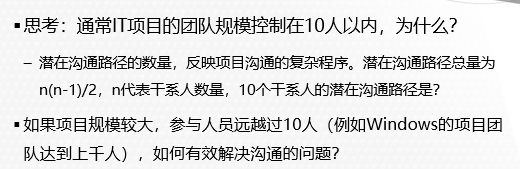

### **规划风险：**

**怎么解决计划赶不上变化**

1. 识别风险

   

   **识别风险的方法：**

    文档审查

    头脑风暴

    核对表分析

   **风险分解结构(RBS)**

   ​    

   

2. 实施定性风险分析

3. 规划风险应对

   针对项目目标，制定提高机会、降低威胁的方案和措施

   **消极风险或威胁的应对措施：**

   ​    

     **积极风险或机会的应对策略：**

   ​    

### **规划的整合**

## 第四章 项目执行与监控

**执行与监控阶段的过程概述：**

**1.  组建团队、分工**

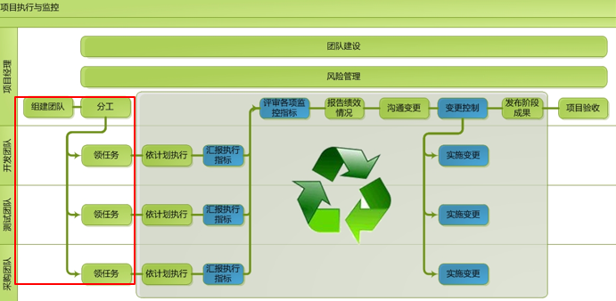

- 由项目经理主要负责

  

**2. 执行、汇报绩效指标：**

​        

持续集成、每日集成

**3. 评审绩效：**

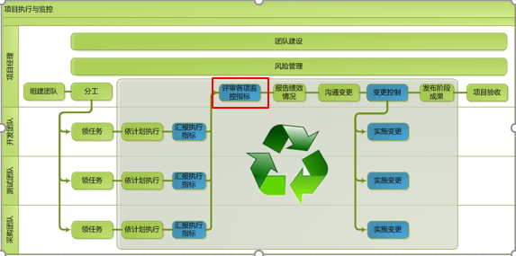

**评审各项绩效指标：**

**分析成本偏差：挣值管理(EVM)**

**EVM中的重要概念：**

**挣值(EV): 截至某时间点实际已完成工作的预算价值**

**挣值分析法操作步骤：**

 

**练习：**

**挣值管理中EV的估算方法：**

  

**分析进度偏差原因：**

**分析范围偏差原因：**

**分析成本偏差原因：**

**4. 报告绩效、沟通变更**

**报告绩效情况**

**5. 变更控制 & 实施变更**

**变更原则：****尽快回到基准路径**

**6. 发布成果 & 项目验收**

**7. 项目验收**

**验收过程：**

**7. 项目团队建设和管理**

**团队发展阶段**

**建设团队**

1. 人际关系
2. 基本规则
3. 培训
4. 集中办公
5. 认可和奖励

6. 团队建设活动

   

**管理团队**

**8. 风险管理**

## 第五章 项目收尾

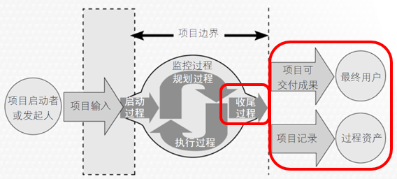

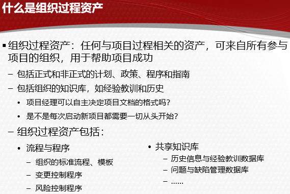

 ### 1 结束项目

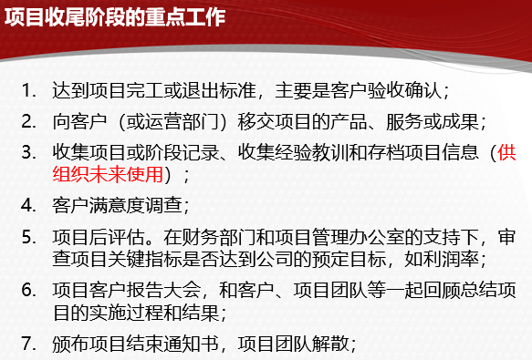

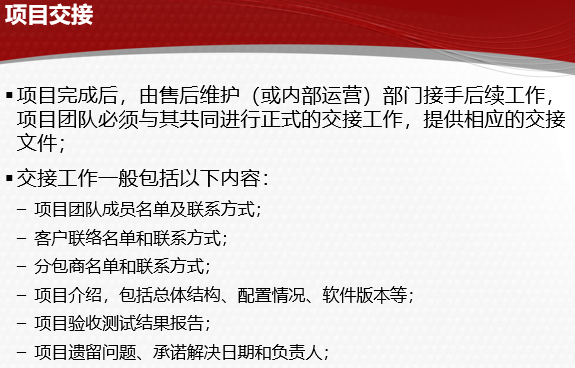

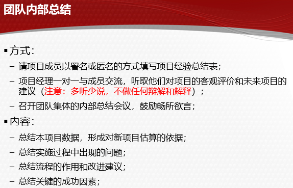

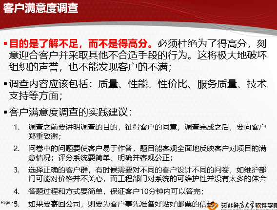

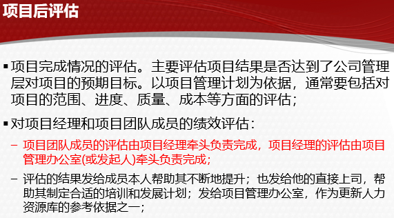

**项目客户报告大会**

**结束项目或阶段的成果**

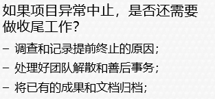

### 2 结束采购

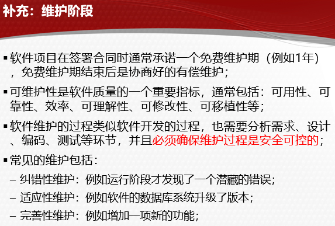

\3. 规划范围时，制定的范围说明书分为两种，分别是定义实现工作的______产品范围说明书______和定义管理工作的______项目范围说明书______。                                    